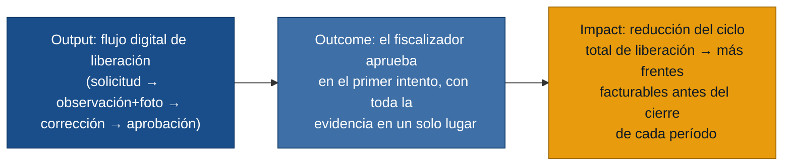

# MVP Canvas — Sistema de Liberaciones de Obra

Generado el 2026-06-21. Basado en 5 entrevistas de primera mano.

---

## Cadena de valor del MVP

---

## Canvas

| Bloque | Contenido |
|---|---|
| **Propuesta de valor** | Reemplazar los canales fragmentados (WhatsApp, correo, minutas) por un flujo único y trazable: desde la solicitud de campo hasta la aprobación del fiscalizador, con fotos vinculadas y estados visibles por todos los roles en tiempo real. |
| **Segmento de usuarios** | Inspector de Calidad y Residente de Obra (usan el sistema en campo diariamente). Fiscalizador del Cliente (aprueba; es el cierre del ciclo). Jefe de Proyecto y Coordinadora Documental (consumen el estado y la trazabilidad). |
| **Funcionalidades mínimas** | 1. Registro de solicitud de liberación por actividad/frente (R-01). 2. Registro de observación con foto desde móvil, vinculada al punto de inspección (R-02, R-05). 3. Flujo de estados solicitado → observado → corregido → liberado, visible por todos (R-03). 4. Control de roles: solo calidad o cliente puede cerrar una observación o aprobar una liberación (R-04). 5. Vista de estado por frente con responsable en turno (R-07). 6. Registro de auditoría inmutable de cada cambio de estado (R-06). |
| **Resultado esperado (outcome)** | El fiscalizador del cliente puede revisar y aprobar una liberación con toda la evidencia disponible en el sistema sin necesitar pedir respaldo adicional. El residente sabe al inicio de cada jornada qué actividades están bloqueadas y por quién, sin mensajes de WhatsApp. |
| **Métrica de éxito** | **Tasa de aprobación en primer intento:** porcentaje de solicitudes de liberación que el fiscalizador aprueba sin devolverlas por información incompleta, medido semana a semana durante las primeras 4 semanas de uso. Meta: alcanzar ≥ 70 % en la semana 4. Prueba ácida: si la tasa sube, el jefe de proyecto puede decidir en qué semana desactivar los grupos de WhatsApp de coordinación de obra y avanzar la facturación sin reconciliación manual. La línea base (tasa actual de devoluciones) se levanta en la primera semana del piloto, antes de activar el flujo completo. |
| **Riesgos / supuestos** | 1. El inspector de campo adoptará el sistema móvil en lugar de volver al papel (riesgo de adopción). 2. El fiscalizador del cliente aceptará la aprobación digital como suficiente para sus auditorías internas (riesgo de valor documental). 3. El flujo de cuatro estados es suficientemente simple para no requerir capacitación extensa (riesgo de usabilidad). 4. Hay conectividad suficiente en obra para trabajar sin modo offline en la etapa piloto (riesgo técnico diferido). |
| **Fuera de alcance (por ahora)** | **Modo offline con sincronización (R-16):** complejidad técnica alta; priorizar adopción en línea antes de invertir en sincronización diferida. **Exportación PDF/Excel (R-10):** útil para la coordinadora, pero no es el núcleo del ciclo de valor; entra en la siguiente iteración. **Tablero de KPIs avanzados —días promedio, ranking por responsable— (R-09):** solo tiene valor con volumen de datos acumulado. **Firma digital con valor legal formal (R-12):** requiere decisión jurídica sobre validez; el registro digital en el sistema es suficiente para el piloto. **Nomenclatura forzada de frentes (R-15):** necesita configuración inicial por proyecto; se aborda antes del lanzamiento a producción, no en el piloto. **Clasificación de observaciones por criticidad (R-13):** deseable, pero no indispensable para probar el ciclo núcleo. |

---

## ¿Por qué este alcance?

El dolor que aparece en las 5 entrevistas de forma independiente es el mismo:
**nadie tiene una foto única del estado de una liberación.** Producción dice que
terminó, calidad que observó, documental que falta respaldo, el cliente que no
aprueba. Cada uno lo gestiona por su canal.

El MVP ataca ese dolor núcleo: un canal único con estados visibles y evidencia
vinculada. Todo lo demás —exportaciones, KPIs, firma legal, offline— construye
sobre ese canal; no tiene sentido construirlo si el canal base no se adopta.

La métrica de tasa de aprobación en primer intento es la señal más directa de
que la fragmentación se está resolviendo: si el fiscalizador aprueba sin pedir
respaldo extra, significa que el inspector registró bien la evidencia, el residente
adjuntó los documentos y el sistema la entregó íntegra.
