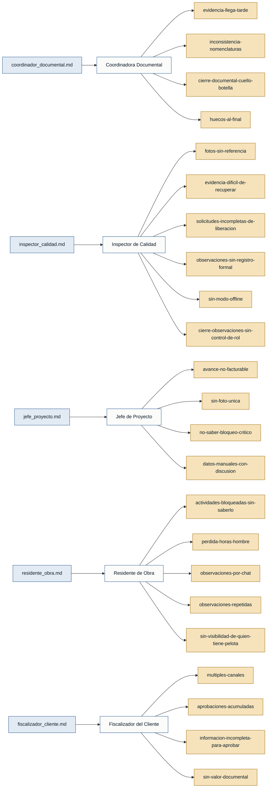

# Personas y Stakeholders — Liberaciones de Obra

Generado el 2026-06-21. Fuente: 5 entrevistas en `interviews/`.

---

## Mapa de trazabilidad

---

## Personas

### Coordinadora Documental — coordinador_documental
- **Contexto:** Consolida toda la evidencia de campo (fotos, protocolos, certificados, planos) para armar dossiers y entregables de calidad que se entregan al cliente.
- **Objetivo principal:** Recibir evidencia ya ordenada y trazable desde campo para cerrar dossiers sin perseguir archivos de cada área.
- **Dolores:**
  - La evidencia llega cuando el cliente ya está pidiendo el dossier; empieza una carrera de último momento. `(coordinador_documental.md)`
  - Los frentes tienen nombres distintos en el Excel, el plano y las fotos; protocolos sin fecha, fotos sin referencia a la actividad, certificados sin elemento asignado. `(coordinador_documental.md)`
  - El cierre documental es el cuello de botella: el proyecto puede estar avanzado físicamente, pero sin evidencia ordenada el cliente no libera ni se factura. `(coordinador_documental.md)`
  - Al armar todo al final aparecen huecos difíciles de corregir (la cuadrilla ya se fue, el frente ya está tapado). `(coordinador_documental.md)`
- **Respaldo:** `primera mano`

---

### Inspector de Calidad — inspector_calidad
- **Contexto:** Realiza inspecciones en campo contra plano o ITP, toma fotos, registra observaciones y da el visto bueno para liberar una actividad.
- **Objetivo principal:** Registrar inspecciones y evidencias en el momento de la inspección, vinculadas al punto exacto, sin retrabajo posterior.
- **Dolores:**
  - Las fotos se toman en campo pero se ordenan después; al cierre del día no se sabe qué foto corresponde a qué observación. `(inspector_calidad.md)`
  - Para recuperar evidencia hay que buscar en WhatsApp, en la galería del celular y en carpetas del computador; si el inspector que tomó la foto no está, peor. `(inspector_calidad.md)`
  - Producción solicita liberar actividades incompletas (falta limpieza, torque, pintura, certificado o plano); la observación se levanta pero sin registro formal genera retrabajo. `(inspector_calidad.md)`
  - Si la observación no queda bien registrada, al día siguiente vuelven a llamar por lo mismo. `(inspector_calidad.md)`
  - En obra no siempre hay internet; si el sistema no funciona offline la gente vuelve al papel. `(inspector_calidad.md)`
  - Cualquiera podría cerrar observaciones; el cierre debería estar restringido a calidad o al cliente. `(inspector_calidad.md)`
- **Respaldo:** `primera mano`

---

### Jefe de Proyecto — jefe_proyecto
- **Contexto:** Responsable de la gestión global del proyecto: cronograma, recursos, facturación y relación con el cliente.
- **Objetivo principal:** Diferenciar en tiempo real avance ejecutado, avance liberado y avance facturable para tomar decisiones de reasignación y escalamiento.
- **Dolores:**
  - El avance físico y el avance facturable difieren; la diferencia se arma manualmente y con mucha discusión. `(jefe_proyecto.md)`
  - Ninguna área tiene una foto única del estado: producción dice que terminó, calidad que observó, documental que falta respaldo, el cliente que no aprueba. `(jefe_proyecto.md)`
  - No se sabe qué observación bloquea el siguiente hito o afecta la facturación. `(jefe_proyecto.md)`
  - No hay forma automatizada de rastrear observaciones vencidas por responsable para poder escalar. `(jefe_proyecto.md)`
- **Respaldo:** `primera mano`

---

### Residente de Obra — residente_obra
- **Contexto:** Coordina en campo el avance de producción, programa cuadrillas y actividades diarias.
- **Objetivo principal:** Conocer en tiempo real qué actividades están bloqueadas para planificar el día siguiente sin sorpresas ni pérdida de horas-hombre.
- **Dolores:**
  - Programa actividades para el día siguiente y en la noche se entera de que la actividad anterior no está liberada; rompe el plan. `(residente_obra.md)`
  - Las cuadrillas llegan al frente y no pueden trabajar por falta de firma, foto, ensayo u observación del cliente; se pierden horas-hombre. `(residente_obra.md)`
  - Las observaciones llegan por mensajes con fotos marcadas pero sin seguimiento formal; nadie sabe si ya se corrigió o quién es responsable. `(residente_obra.md)`
  - Hay observaciones repetidas porque nadie cierra formalmente el punto. `(residente_obra.md)`
  - No hay claridad sobre quién tiene la pelota en cada momento (calidad, producción o cliente). `(residente_obra.md)`
- **Respaldo:** `primera mano`

---

### Fiscalizador del Cliente — fiscalizador_cliente
- **Contexto:** Representante del cliente en obra; aprueba o rechaza liberaciones y es responsable ante auditorías internas del cliente.
- **Objetivo principal:** Tener trazabilidad completa de aprobaciones y evidencias para justificar cada decisión ante auditorías, sin depender de canales informales.
- **Dolores:**
  - Le dicen "ya está liberado" pero al pedir respaldo falta el protocolo, una firma o la foto no muestra la corrección; no puede aprobar solo por un mensaje de WhatsApp. `(fiscalizador_cliente.md)`
  - Las observaciones llegan por reuniones, correo, minutas y mensajes; hay versiones conflictivas de la lista válida. `(fiscalizador_cliente.md)`
  - Se acumulan muchas aprobaciones al final del día o la semana; es imposible revisarlas bien. `(fiscalizador_cliente.md)`
  - Cuando la información llega incompleta devuelve todo, lo que genera tensión con el contratista. `(fiscalizador_cliente.md)`
  - No queda claro si su aprobación en un sistema digital tiene valor documental formal. `(fiscalizador_cliente.md)`
- **Respaldo:** `primera mano`

---

## Stakeholders

### Cuadrillas de producción
- **Interés en el sistema:** Recibir instrucciones claras sobre qué actividades están habilitadas para ejecutar; evitar presentarse a frentes bloqueados.
- **Fuente:** `residente_obra.md`, `coordinador_documental.md`

> No entrevistadas. Rol mencionado por residente de obra y coordinadora documental.

---

### Auditoría del cliente
- **Interés en el sistema:** Verificar que las aprobaciones del fiscalizador cuenten con respaldo documental trazable y no hayan sido alteradas.
- **Fuente:** `fiscalizador_cliente.md`

> No entrevistada. Rol mencionado por el fiscalizador del cliente como condicionante de su comportamiento.

---

### Alta gerencia / comité de proyecto
- **Interés en el sistema:** Recibir información consolidada sobre bloqueos, observaciones vencidas y estado de facturabilidad para tomar decisiones estratégicas.
- **Fuente:** `jefe_proyecto.md`

> No entrevistada. Mencionada por el jefe de proyecto como destinataria de escalamientos.
