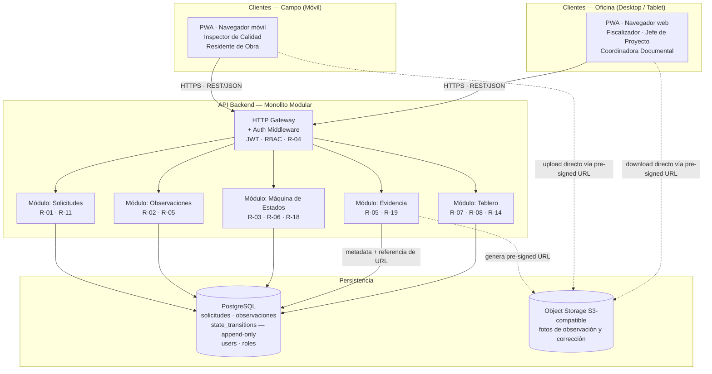

# Arquitectura — liberaciones_obra

## Contexto y restricciones

Las siguientes fuerzas determinan cada decisión de este documento. Toda alternativa
técnica se evalúa contra ellas, no contra preferencias abstractas.

| Fuerza | Origen |
|---|---|
| Piloto de 4 semanas con equipo pequeño; la velocidad de entrega supera la elegancia técnica | `mvp-canvas#riesgos-supuestos`, `mvp-canvas#métrica-de-éxito` |
| Inspector de Calidad opera desde el celular en campo; el flujo de registro no debe superar 1 minuto (R-17). Es la persona más crítica para la adopción | `personas#inspector_calidad`, `requisitos#R-17`, `E-01-S02` |
| Las fotos son el activo que cierra el ciclo de valor: sin foto vinculada, el fiscalizador no puede aprobar en el primer intento | `requisitos#R-05`, `E-01-S02`, `E-02-S01`, `mvp-canvas#resultado-esperado` |
| La trazabilidad con identidad y timestamp es contractual: R-06 y R-18 determinan si el sistema tiene valor documental o no | `requisitos#R-06`, `requisitos#R-18`, `E-04-S02`, `personas#fiscalizador_cliente` |
| El tablero del Jefe de Proyecto debe reflejar cambios en menos de 60 segundos (R-08, E-03-S03) | `requisitos#R-08`, `user-stories#US-06`, `personas#jefe_proyecto` |
| El modo offline (R-16) está fuera del alcance del piloto; se asume conectividad en campo | `mvp-canvas#fuera-de-alcance`, OQ-02 |
| No se requieren dos bases de código nativas (iOS + Android) en un piloto; el presupuesto técnico es acotado | `mvp-canvas#riesgos-supuestos`, `personas#inspector_calidad` |

---

## Diagrama de componentes

Las líneas continuas son llamadas sincrónicas REST. Las líneas punteadas representan
operaciones directas contra el object storage usando URLs pre-firmadas generadas por
el Módulo Evidencia: el binario de la foto nunca pasa por el API backend.

---

## Descripción de componentes

| Componente | Responsabilidad | Tecnología sugerida |
|---|---|---|
| **PWA — Cliente único** | Interfaz para los 5 roles. Acceso a cámara desde móvil (E-01-S02, R-05). Polling periódico para el tablero (E-03-S03). | Framework SPA (React / Vue / Svelte — por decidir el equipo). Service Worker para cacheo básico de assets. |
| **HTTP Gateway + Auth Middleware** | Recibe todas las solicitudes HTTPS. Valida el JWT, verifica el rol (RBAC) y rechaza acciones no autorizadas antes de llegar a los módulos (R-04). Punto único de entrada. | Middleware del mismo framework backend. |
| **Módulo Solicitudes** | CRUD de solicitudes de liberación. Persiste código de frente, responsable, fecha y documentos adjuntos (R-01, R-11). El estado inicial siempre es `solicitado`. | Módulo interno del monolito. |
| **Módulo Observaciones** | Registra observaciones vinculadas a una solicitud: descripción, referencia a foto, responsable de corrección, fecha compromiso (R-02). | Módulo interno del monolito. |
| **Módulo Máquina de Estados** | Controla las transiciones permitidas (`solicitado → observado → corregido → liberado`). Por cada transición escribe una fila en `state_transitions` con actor e timestamp. Bloquea mutaciones sobre registros `liberado` (R-03, R-06, R-18). | Módulo interno. La tabla `state_transitions` es append-only: sin UPDATE ni DELETE. |
| **Módulo Evidencia** | Genera pre-signed URLs para upload/download directo al object storage. Persiste la referencia (clave S3 + URL de acceso) vinculada a la observación o corrección correspondiente (R-05, R-19). | SDK del proveedor S3-compatible. |
| **Módulo Tablero** | Calcula aggregations sobre las tablas de solicitudes y `state_transitions`: conteo por estado, vencidas por responsable, días de retraso. Responde al polling del cliente (R-07, R-08, R-14). | Módulo interno. Consultas SQL sobre PostgreSQL. |
| **PostgreSQL** | Almacén relacional principal. Tablas: `solicitudes`, `observaciones`, `state_transitions` (append-only), `evidence_refs`, `users`, `roles`. | PostgreSQL >= 14. Hosteado en proveedor cloud (RDS, Supabase, Neon — por decidir). |
| **Object Storage S3-compatible** | Almacena el binario de las fotos. Las referencias viven en la BD; el storage no se consulta directamente por el API. | AWS S3, Cloudflare R2, MinIO o equivalente. El binario nunca pasa por el backend. |

---

## Decisiones clave (resumen de ADRs)

| ADR | Decisión |
|---|---|
| ADR-0001 · pwa-cliente-unico | Se usa una PWA como cliente único para acceso móvil y desktop, en lugar de apps nativas separadas. |
| ADR-0002 · monolito-modular-backend | El backend es un monolito con módulos internos desacoplados, en lugar de microservicios. |
| ADR-0003 · object-storage-fotos | Las fotos se almacenan en object storage S3-compatible; la BD solo guarda la referencia. |
| ADR-0004 · tabla-transiciones-audit-trail | La máquina de estados escribe en una tabla `state_transitions` append-only como audit trail estructural. |
| ADR-0005 · polling-http-tablero | El tablero del Jefe de Proyecto se actualiza por polling HTTP cada 30 s, sin WebSockets ni SSE. |

---

## Open questions activas y su impacto arquitectónico

### OQ-01 — Valor documental formal de la aprobación digital

**Pregunta:** ¿La aprobación del fiscalizador dentro del sistema tiene valor documental
formal suficiente para auditorías internas del cliente?

**Impacto si se resuelve negativamente:** el sistema necesitaría un mecanismo de firma
digital con valor legal (R-12 completo: certificado de firma, integración con proveedor
de FEA). Esto requeriría un módulo de firma adicional e integración externa, y podría
requerir que el documento firmado se almacene como artefacto inmutable separado
(PDF/A con firma embebida). La arquitectura actual puede absorber este módulo, pero
su alcance y costo están fuera de las decisiones del piloto.

**Fuente:** `mvp-canvas#riesgos-supuestos` (riesgo 2), `personas#fiscalizador_cliente`
(pain: sin-valor-documental), `requisitos#R-12`.

---

### OQ-02 — Conectividad suficiente en campo durante el piloto

**Pregunta:** ¿Hay conectividad estable en todos los frentes del piloto para trabajar
sin modo offline?

**Impacto si se resuelve negativamente:** el Inspector de Calidad volvería al papel,
invalidando E-01 y todo el ciclo de valor. La arquitectura actual (PWA online) tendría
que extenderse con un Service Worker que cache solicitudes pendientes y las sincronice
al recuperar red (Background Sync API). El backend necesitaría manejo de operaciones
idempotentes y resolución de conflictos. La tabla `state_transitions` facilita esto
(las transiciones son eventos ordenables), pero el trabajo técnico es significativo.
No debe iniciarse sin confirmar que la conectividad del piloto es insuficiente.

**Fuente:** `mvp-canvas#fuera-de-alcance` (R-16), `personas#inspector_calidad`
(pain: sin-modo-offline), OQ-02.
