# Epicas del Delivery: liberaciones_obra

## Resumen
- Total epicas: 4
- Total historias candidatas: 13
- Fecha: 2026-06-28
- Fuente de verdad: 5 entrevistas de primera mano (coordinador_documental, inspector_calidad, jefe_proyecto, residente_obra, fiscalizador_cliente)

---

## Backlog por prioridad

### E-01 · Flujo de solicitud y observacion en campo

**Goal:** El Inspector de Calidad y el Residente de Obra registran solicitudes de liberacion y observaciones con foto directamente en el sistema, eliminando la coordinacion por WhatsApp y garantizando que calidad pueda inspeccionar sin buscar contexto en canales externos.

**Origin:** `mvp-canvas#funcionalidades-mínimas` (items 1-4), `user-stories#US-01`, `user-stories#US-02`, `user-stories#US-03`, `requisitos#R-01`, `requisitos#R-02`, `requisitos#R-03`, `requisitos#R-04`, `requisitos#R-05`, `requisitos#R-11`, `requisitos#R-17`

**Prioridad: 1** — Es la epica de mayor riesgo (adopcion de campo) y la condicion necesaria de todo lo demas: sin datos ingresados correctamente en el sistema, ninguna otra epica tiene valor.

#### Historias candidatas

- **E-01-S01:** Como Residente de Obra, quiero registrar una solicitud de liberacion con codigo de frente, responsable, documentos adjuntos y estado inicial "solicitado", para que calidad pueda procesarla sin necesitar mensajes por WhatsApp.
  - Origin: `user-stories#US-01`, `requisitos#R-01`, `requisitos#R-11`

- **E-01-S02:** Como Inspector de Calidad, quiero registrar una observacion con descripcion, foto y responsable de correccion directamente desde el celular en el momento de la inspeccion, para no tener que ordenar fotos al final del dia.
  - Origin: `user-stories#US-02`, `requisitos#R-02`, `requisitos#R-05`

- **E-01-S03:** Como Inspector de Calidad, quiero que el flujo de registro de una observacion desde el movil no supere un minuto en condiciones normales, para no interrumpir el ritmo de la inspeccion ni generar retrabajo al final del turno.
  - Origin: `requisitos#R-17`, `personas#inspector_calidad` (pain: fotos-sin-referencia, observaciones-sin-registro-formal)

- **E-01-S04:** Como Inspector de Calidad o Fiscalizador del Cliente, quiero ser el unico rol autorizado para cerrar una observacion o cambiar el estado a "liberado", para que ningun cambio de estado quede sin la revision del responsable correcto.
  - Origin: `user-stories#US-03`, `requisitos#R-04`

- **E-01-S05:** Como cualquier usuario autenticado, quiero ver el estado de la solicitud avanzar automaticamente (solicitado → observado → corregido → liberado) segun las acciones registradas, para que el flujo sea inequivoco y no dependa de actualizaciones manuales fuera del sistema.
  - Origin: `requisitos#R-03`, `mvp-canvas#funcionalidades-mínimas` (item 3)

---

### E-02 · Aprobacion del fiscalizador con evidencia completa

**Goal:** El Fiscalizador del Cliente puede revisar y aprobar una liberacion en el primer intento porque toda la evidencia (foto de la observacion, foto de la correccion, identidad de cada responsable y timestamps) esta disponible en un solo lugar dentro del sistema.

**Origin:** `mvp-canvas#resultado-esperado`, `mvp-canvas#métrica-de-éxito`, `user-stories#US-04`, `requisitos#R-05`, `requisitos#R-06`, `requisitos#R-12` (parcial: registro digital suficiente para piloto), `requisitos#R-19`

**Prioridad: 2** — Es la metrica de exito del MVP (tasa de aprobacion en primer intento >= 70 % en semana 4); sin esta epica no se puede medir ni demostrar el valor central del producto.

#### Historias candidatas

- **E-02-S01:** Como Fiscalizador del Cliente, quiero revisar una solicitud en estado "corregido" y ver toda la evidencia (foto de la observacion original, foto de la correccion, responsable y timestamp de cada cambio de estado) en un solo lugar, para decidir la aprobacion sin pedir respaldo adicional.
  - Origin: `user-stories#US-04`, `requisitos#R-05`, `requisitos#R-06`

- **E-02-S02:** Como Fiscalizador del Cliente, quiero registrar mi aprobacion formal con mi identidad y la fecha/hora exacta, para que el estado "liberado" quede como cierre inmutable e irrefutable en el sistema.
  - Origin: `user-stories#US-04`, `requisitos#R-06`, `requisitos#R-12` (parcial)

- **E-02-S03:** Como Fiscalizador del Cliente, quiero poder descargar toda la evidencia de un punto (fotos de observacion y de cierre) directamente desde el sistema, para no depender del contratista para obtener capturas cuando las necesito para mis auditorias internas.
  - Origin: `requisitos#R-19`, `personas#fiscalizador_cliente` (pain: sin-valor-documental, informacion-incompleta-para-aprobar)

---

### E-03 · Visibilidad del estado para la planificacion diaria

**Goal:** El Residente de Obra conoce al inicio de cada jornada que actividades estan bloqueadas y por quien; el Jefe de Proyecto identifica en tiempo real que frentes bloquean la facturacion sin armar resumenes manuales.

**Origin:** `user-stories#US-05`, `user-stories#US-06`, `mvp-canvas#funcionalidades-mínimas` (item 5), `requisitos#R-07`, `requisitos#R-08`, `requisitos#R-14`

**Prioridad: 3** — Cambia el comportamiento de planificacion del residente y del jefe; consolida la adopcion del lado de produccion y hace tangible la eliminacion de los grupos de WhatsApp de coordinacion, que es la prueba acida del MVP Canvas.

#### Historias candidatas

- **E-03-S01:** Como Residente de Obra, quiero ver el estado actual de cada actividad/frente (solicitado, observado, corregido, liberado) y el responsable en turno, para planificar el dia siguiente sin descubrir bloqueos en el ultimo momento.
  - Origin: `user-stories#US-05`, `requisitos#R-07`

- **E-03-S02:** Como Residente de Obra, quiero ver un indicador diario que diferencie visualmente las actividades con observaciones cuya fecha compromiso ya vencio, para priorizar correcciones al inicio de la jornada sin revisar cada registro una a una.
  - Origin: `requisitos#R-14`, `user-stories#US-05` (criterio de aceptacion 2), `personas#residente_obra` (pain: actividades-bloqueadas-sin-saberlo)

- **E-03-S03:** Como Jefe de Proyecto, quiero ver un tablero con el conteo de liberaciones por estado (solicitadas, observadas, corregidas, liberadas, vencidas) en tiempo real, para identificar que frentes bloquean la facturacion sin tener que armar el resumen manualmente.
  - Origin: `user-stories#US-06`, `requisitos#R-08`, `personas#jefe_proyecto` (pain: avance-no-facturable, no-saber-bloqueo-critico)

---

### E-04 · Trazabilidad documental e integridad de registros

**Goal:** La Coordinadora Documental puede armar dossiers con la cadena completa de cambios de estado, identidades y timestamps directamente desde el sistema, sin perseguir archivos dispersos; y los registros aprobados son inmutables con rastro de auditoria para soportar revisiones del cliente.

**Origin:** `user-stories#US-07`, `mvp-canvas#funcionalidades-mínimas` (item 6), `requisitos#R-06`, `requisitos#R-18`, `personas#coordinador_documental` (pains: evidencia-llega-tarde, cierre-documental-cuello-botella, huecos-al-final)

**Prioridad: 4** — La trazabilidad de cada cambio de estado (R-06) se construye en E-01 y E-02; esta epica consolida la vista documental y la inmutabilidad para la coordinadora y las auditorias. Tiene menor urgencia de adopcion inicial pero es critica antes del primer cierre de periodo.

#### Historias candidatas

- **E-04-S01:** Como Coordinadora Documental, quiero consultar el historial completo de una solicitud con todos sus cambios de estado en orden cronologico (quien hizo que y cuando), para armar el dossier sin perseguir archivos de cada area.
  - Origin: `user-stories#US-07`, `requisitos#R-06`

- **E-04-S02:** Como Coordinadora Documental, quiero que los registros aprobados por el fiscalizador no puedan editarse sin que el sistema genere un rastro de auditoria inmutable (quien intento modificarlo y cuando), para garantizar la integridad documental frente a las auditorias del cliente.
  - Origin: `user-stories#US-07`, `requisitos#R-18`

- **E-04-S03:** Como Coordinadora Documental, quiero que cada solicitud, observacion, correccion y aprobacion quede asociada al codigo de frente correspondiente, para que el dossier pueda organizarse por frente sin reconciliacion manual de nomenclaturas.
  - Origin: `user-stories#US-07`, `requisitos#R-01` (campo: codigo de actividad/frente), `personas#coordinador_documental` (pain: inconsistencia-nomenclaturas)
  - Notas: R-15 (nomenclatura forzada) esta fuera de alcance del piloto segun mvp-canvas; esta historia cubre el minimo de asociar el codigo que el usuario ingresa, sin validacion forzada. Ver OQ-03.

---

## Preguntas abiertas

- **OQ-01 [BLOQUEANTE]:** El fiscalizador del cliente declara el dolor "sin-valor-documental": no tiene claro si su aprobacion en un sistema digital tiene validez ante las auditorias internas de su organizacion. El MVP Canvas asume que el registro digital es suficiente para el piloto pero no hay confirmacion del fiscalizador. Si no lo acepta, la E-02 no cierra el ciclo de valor. Debe resolverse antes de iniciar el piloto con el fiscalizador.
  - Fuente: `personas#fiscalizador_cliente` (pain: sin-valor-documental), `mvp-canvas#riesgos-supuestos` (riesgo 2)

- **OQ-02 [BLOQUEANTE para adopcion]:** El MVP Canvas asume conectividad suficiente en obra y difiere el modo offline (R-16). Si los frentes del piloto no tienen conectividad estable, los inspectores volverian al papel invalidando E-01. Debe verificarse la conectividad real en los frentes del piloto antes de descartar R-16.
  - Fuente: `mvp-canvas#riesgos-supuestos` (riesgo 4), `personas#inspector_calidad` (pain: sin-modo-offline)

- **OQ-03 [NO bloqueante para piloto]:** R-15 (nomenclatura forzada de frentes) esta explicitamente fuera del alcance del piloto pero se necesita antes de pasar a produccion. No esta definido quien configura la nomenclatura inicial ni en que momento. La historia E-04-S03 cubre el minimo; la validacion completa queda pendiente.
  - Fuente: `mvp-canvas#fuera-de-alcance`, `requisitos#R-15`

- **OQ-04 [NO bloqueante para piloto]:** R-19 (descarga autonoma de evidencia por el fiscalizador) no aparece en las funcionalidades minimas del canvas ni en la lista de fuera de alcance. La historia E-02-S03 la incluye como candidata porque resuelve el dolor "sin-valor-documental" y "informacion-incompleta-para-aprobar", pero el equipo debe confirmar si entra en el piloto o en la siguiente iteracion.
  - Fuente: `requisitos#R-19`, `personas#fiscalizador_cliente` (pain: informacion-incompleta-para-aprobar)

---

## Diagrama del backlog

```mermaid
graph TD
  MVP["MVP: liberaciones_obra
  Metrica: tasa aprobacion primer intento >= 70%
  en semana 4 del piloto"]

  MVP --> E01["E-01 · Flujo solicitud y observacion en campo
  PRIORIDAD 1
  Inspector de Calidad + Residente de Obra"]

  MVP --> E02["E-02 · Aprobacion del fiscalizador
  con evidencia completa
  PRIORIDAD 2
  Fiscalizador del Cliente"]

  MVP --> E03["E-03 · Visibilidad del estado
  para planificacion diaria
  PRIORIDAD 3
  Residente de Obra + Jefe de Proyecto"]

  MVP --> E04["E-04 · Trazabilidad documental
  e integridad de registros
  PRIORIDAD 4
  Coordinadora Documental"]

  E01 --> S01["E-01-S01: Registrar solicitud de liberacion
  (Residente)"]
  E01 --> S02["E-01-S02: Registrar observacion con foto
  desde movil (Inspector)"]
  E01 --> S03["E-01-S03: Flujo de registro en movil
  menor a 1 minuto (Inspector)"]
  E01 --> S04["E-01-S04: Control de roles para cerrar
  observacion o aprobar (Inspector/Fiscalizador)"]
  E01 --> S05["E-01-S05: Avance automatico de estados
  solicitado→observado→corregido→liberado"]

  E02 --> S06["E-02-S01: Ver evidencia completa para
  aprobar en primer intento (Fiscalizador)"]
  E02 --> S07["E-02-S02: Registrar aprobacion formal
  con identidad y timestamp (Fiscalizador)"]
  E02 --> S08["E-02-S03: Descargar evidencia de un punto
  autonomamente (Fiscalizador)"]

  E03 --> S09["E-03-S01: Ver estado y responsable
  por frente/actividad (Residente)"]
  E03 --> S10["E-03-S02: Indicador diario de
  observaciones vencidas (Residente)"]
  E03 --> S11["E-03-S03: Tablero de liberaciones
  por estado en tiempo real (Jefe)"]

  E04 --> S12["E-04-S01: Historial cronologico
  completo de una solicitud (Coordinadora)"]
  E04 --> S13["E-04-S02: Inmutabilidad con rastro
  de auditoria en registros aprobados (Coordinadora)"]
  E04 --> S14["E-04-S03: Solicitudes asociadas
  al codigo de frente (Coordinadora)"]

  style E01 fill:#1A4E8A,color:#fff
  style E02 fill:#3E6FA6,color:#fff
  style E03 fill:#5A8FC0,color:#fff
  style E04 fill:#7AAFDA,color:#0E1A26
  style MVP fill:#E89B0C,color:#0E1A26
```

